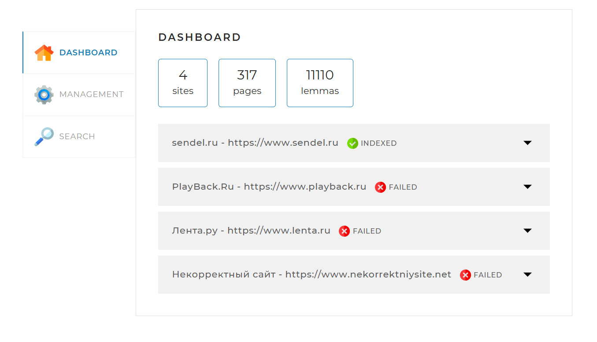
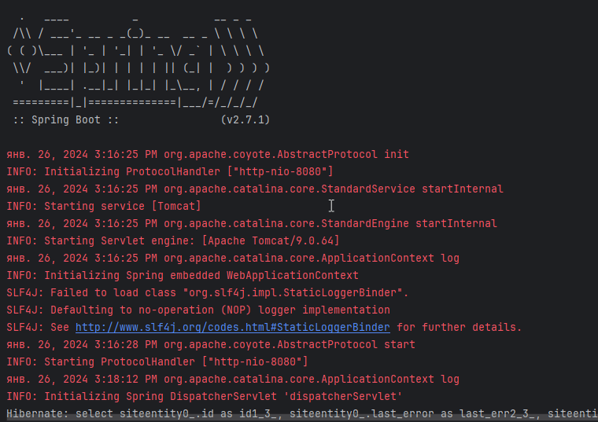
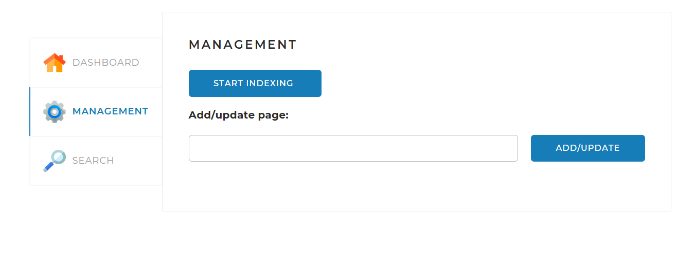

# Поисковый движок
## Описание сервиса:
- Данный сервис позволяет запускать и останавливать индексацию сайтов, описанных в файлике **application.yaml**
- Отображает общую статистику по всем индексируемым сайтам, статус по каждому из сайтов
- Предоставляет инструменты управления поисковым движком — запуск и остановка полной индексации (переиндексации), а также возможность добавить (обновить) отдельную страницу по ссылке
- Отображает поле поиска и выпадающий список с выбором сайта для поиска, а при нажатии на кнопку «Найти» выводятся результаты поиска

# Главная экранная форма поискового движка с индексацией страниц сайта

# Требования:
* Java 17
* Mysql 8

## Технологии в проекте
Проект реализован с использованием следующих фреймворков:
* **Spring Boot** 3.3.1 - фреймворк для разработки веб-приложений на Java. С помощью него можно развернуть локальный сервер для проверки написанного веб-приложения. 
* **thymeleaf** - фреймворк для генерации HTML кода и шаблонизации, с помощью него мы заполняем страницу сайта поисковика результатами из приложения.
* **Jsoup** 1.18.1 - библиотека, позволяющая выполнять запросы к сайтам.
* **Lombok** - библиотека, автоматически генерирующая код в создаваемых классах, который обычно приходиться присать вручную. Например геттеры и сеттеры, конструкторы либо создавать операторы бизнесового сравнения объекта класса.
* **Slf4j** - это библиотека для логирования в Java. Она позволяет регистрировать сообщения об ошибках, предупреждениях, и других событиях.
* **Morphology** - библиотека для морфологического анализа русского языка. Она позволяет разбивать слова на составные части, такие как корни, приставки, и суффиксы.
**_С помощью данной библиотеки построена основная логика разбора и анализа слов при индексации страниц сайта_**
* **Mysql** 8.0.33 - библиотека для морфологического анализа русского языка. Она позволяет разбивать слова на составные части, такие как корни, приставки, и суффиксы.
* **Liquibase** - библиотека для проведения миграций и изменения БД.

## Установка
1) Для установки проекта склонируйте репозиторий:
https://github.com/Gear-Droid/searchengine.git
2) Перейдите в каталог проекта
3) Скомпилируйте и запустите проект. В окне терминала должна будет отразиться следующая информация:

### Основные разделы сайта представлены на изображениях ниже:
Результаты индексирования представлены на основной странице `DASHBOARD`:

На вкладке `MANAGEMENT` можно запустить индексирование, а также добавить необходимую страницу сайта в индекс:

На вкладке `SEARCH` имеется поиск и отображаются результаты поиска по интересующей информации:

## Спецификация API

### Запуск полной индексации — GET /api/startIndexing

Метод запускает полную индексацию всех сайтов или полную переиндексацию, если они уже проиндексированы.
Если в настоящий момент индексация или переиндексация уже запущена, метод возвращает соответствующее сообщение об ошибке. 

**Параметры**:

- Метод без параметров

**Формат ответа в случае успеха**:

{
	'result': true
}

**Формат ответа в случае ошибки**:

{
	'result': false,
	'error': "Индексация уже запущена"
}

### Остановка текущей индексации — GET /api/stopIndexing

Метод останавливает текущий процесс индексации (переиндексации). Если в настоящий момент индексация или переиндексация не происходит, метод возвращает соответствующее сообщение об ошибке. 

**Параметры**:

- Метод без параметров.

**Формат ответа в случае успеха**:

{
	'result': true
}

**Формат ответа в случае ошибки**:

{
	'result': false,
	'error': "Индексация не запущена"
}

### Добавление или обновление отдельной страницы — POST /api/indexPage

Метод добавляет в индекс или обновляет отдельную страницу, адрес которой передан в параметре.
Если адрес страницы передан неверно, метод должен вернуть соответствующую ошибку.

**Параметры**:

- url — адрес страницы, которую нужно переиндексировать.

**Формат ответа в случае успеха**:

{
	'result': true
}

**Формат ответа в случае ошибки**:

{
	'result': false,
	'error': "Данная страница находится за пределами сайтов, указанных в конфигурационном файле"
}

### Статистика — GET /api/statistics
	
Метод возвращает статистику и другую служебную информацию о состоянии поисковых индексов и самого движка.
Если ошибок индексации того или иного сайта нет, задавать ключ error не нужно.

**Параметры**:

- Метод без параметров.

**Формат ответа**:

{
	'result': true,
	'statistics': {
		"total": {
			"sites": 10,
			"pages": 436423,
			"lemmas": 5127891,
			"indexing": true
		},
		"detailed": [
			{
				"url": "http://www.site.com",
				"name": "Имя сайта",
				"status": "INDEXED",
				"statusTime": 1600160357,
				"error": "Ошибка индексации: главная страница сайта недоступна",
				"pages": 5764,
				"lemmas": 321115
			},
			...
			]
	}
}

### Получение данных по поисковому запросу — GET /api/search

Метод осуществляет поиск страниц по переданному поисковому запросу (параметр query).
Чтобы выводить результаты порционно, также можно задать параметры offset (сдвиг от начала списка результатов) и limit (количество результатов, которое необходимо вывести).
В ответе выводится общее количество результатов (count), не зависящее от значений параметров offset и limit, и массив data с результатами поиска. Каждый результат — это объект, содержащий свойства результата поиска (см. ниже структуру и описание каждого свойства).
Если поисковый запрос не задан или ещё нет готового индекса (сайт, по которому ищем, или все сайты сразу не проиндексированы), метод должен вернуть соответствующую ошибку (см. ниже пример). Тексты ошибок должны быть понятными и отражать суть ошибок.

**Параметры**:

- query — поисковый запрос;
- site — сайт, по которому осуществлять поиск (если не задан, поиск должен происходить по всем проиндексированным сайтам); задаётся в формате адреса, например: http://www.site.com (без слэша в конце);
- offset — сдвиг от 0 для постраничного вывода (параметр необязательный; если не установлен, то значение по умолчанию равно нулю);
- limit — количество результатов, которое необходимо вывести (параметр необязательный; если не установлен, то значение по умолчанию равно 20).

**Формат ответа в случае успеха**:

{
	'result': true,
	'count': 574,
	'data': [
		{
			"site": "http://www.site.com",
      			"siteName": "Имя сайта",
   			"uri": "/path/to/page/6784",
			"title": "Заголовок страницы, которую выводим",
			"snippet": "Фрагмент текста, в котором найдены совпадения, <b>выделенные жирным</b>, в формате HTML",
			"relevance": 0.93362
		},
	...
	]
}

**Формат ответа в случае ошибки**:

{
	'result': false,
	'error': "Задан пустой поисковый запрос"
}

### Ответы в случае ошибок

Во всех командах API необходимо реализовать корректные ответы в случае возникновения ошибок. Любой метод API может возвращать ошибку, если она произошла. В этом случае ответ должен выглядеть стандартным образом:

{
	'result': false,
	'error': "Указанная страница не найдена"
}

Такие ответы должны сопровождаться соответствующими статус-кодами. Желательно ограничиться использованием кодов 400, 401, 403, 404, 405 и 500 при возникновении соответствующих им типов ошибок.

## Структура базы данных

### site — информация о сайтах и статусах их индексации

- id INT NOT NULL AUTO_INCREMENT;
- status ENUM('INDEXING', 'INDEXED', 'FAILED') NOT NULL — текущий статус полной индексации сайта, отражающий готовность поискового движка осуществлять поиск по сайту — индексация или переиндексация в процессе, сайт полностью проиндексирован (готов к поиску) либо его не удалось проиндексировать (сайт не готов к поиску и не будет до устранения ошибок и перезапуска индексации);
- status_time DATETIME NOT NULL — дата и время статуса (в случае статуса INDEXING дата и время должны обновляться регулярно при добавлении каждой новой страницы в индекс);
- last_error TEXT — текст ошибки индексации или NULL, если её не было;
- url VARCHAR(255) NOT NULL — адрес главной страницы сайта;
- name VARCHAR(255) NOT NULL — имя сайта.

### page — проиндексированные страницы сайта

- id INT NOT NULL AUTO_INCREMENT;
- site_id INT NOT NULL — ID веб-сайта из таблицы site;
- path TEXT NOT NULL — адрес страницы от корня сайта (должен начинаться со слэша, например: /news/372189/);
- code INT NOT NULL — код HTTP-ответа, полученный при запросе страницы (например, 200, 404, 500 или другие);
- content MEDIUMTEXT NOT NULL — контент страницы (HTML-код).

По полю path должен быть установлен индекс, чтобы поиск по нему был быстрым, когда в нём будет много ссылок. Индексы рассмотрены в курсе «Язык запросов SQL».

### lemma — леммы, встречающиеся в текстах (см. справочно: лемматизация).

- id INT NOT NULL AUTO_INCREMENT;
- site_id INT NOT NULL — ID веб-сайта из таблицы site;
- lemma VARCHAR(255) NOT NULL — нормальная форма слова (лемма);
- frequency INT NOT NULL — количество страниц, на которых слово встречается хотя бы один раз. Максимальное значение не может превышать общее количество слов на сайте.

### index — поисковый индекс

- id INT NOT NULL AUTO_INCREMENT;
- page_id INT NOT NULL — идентификатор страницы;
- lemma_id INT NOT NULL — идентификатор леммы;
- rank FLOAT NOT NULL — количество данной леммы для данной страницы.

## Основные моменты, с которыми пришлось столкнуться при реализации проекта:
В процессе разработки были реализованы основные методы взаимодействия `REST` контроллера (_Для взаимодействия страницы с функционалом сервисов и обращения к базе_).

При помощи forkJoinPool были реализованы основные методы параллельного скраппинга страниц сайтов, а также индексация страниц с помощью _лемматизации_ слов.

> [!TIP]
> В процессе разработки и изучении совместного использования различных фреймворков помог анализ готовых проектов, использующих необходимые для разработки технологии. 

