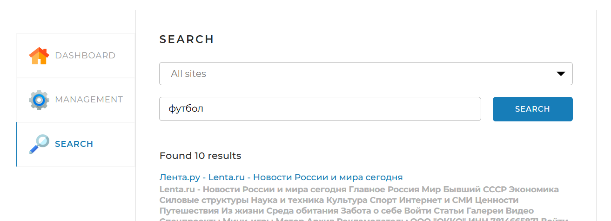

# Поисковый движок

Главная экранная форма поискового движка с индексацией страниц сайта

# Требования:
* Java 17
* Mysql 8

## Установка
1) Для установки проекта склонируйте репозиторий:
https://github.com/Gear-Droid/searchengine.git
2) Перейдите в каталог проекта
3) Скомпилируйте и запустите проект. В окне терминала должна будет отразиться следующая информация:

### Основные разделы сайта представлены на изображениях ниже:
Результаты индексирования представлены на основной странице `DASHBOARD`:

На вкладке `MANAGEMENT` можно запустить индексирование, а также добавить необходимую страницу сайта в индекс:

На вкладке `SEARCH` имеется поиск и отображаются результаты поиска по интересующей информации:

## Технологии в проекте
Проект реализован с использованием следующих фреймворков:
* **Spring Boot** 3.3.1 - фреймворк для разработки веб-приложений на Java. С помощью него можно развернуть локальный сервер для проверки написанного веб-приложения. 
* **thymeleaf** - фреймворк для генерации HTML кода и шаблонизации, с помощью него мы заполняем страницу сайта поисковика результатами из приложения.
* **Jsoup** 1.18.1 - библиотека, позволяющая выполнять запросы к сайтам.
* **Lombok** - библиотека, автоматически генерирующая код в создаваемых классах, который обычно приходиться присать вручную. Например геттеры и сеттеры, конструкторы либо создавать операторы бизнесового сравнения объекта класса.
* **Slf4j** - это библиотека для логирования в Java. Она позволяет регистрировать сообщения об ошибках, предупреждениях, и других событиях.
* **Morphology** - библиотека для морфологического анализа русского языка. Она позволяет разбивать слова на составные части, такие как корни, приставки, и суффиксы.
**_С помощью данной библиотеки построена основная логика разбора и анализа слов при индексации страниц сайта_**
* **Mysql** 8.0.33 - библиотека для морфологического анализа русского языка. Она позволяет разбивать слова на составные части, такие как корни, приставки, и суффиксы.
* **Liquibase** - библиотека для проведения миграций и изменения БД.

### Основные моменты, с которыми пришлось столкнуться при реализации проекта:
В процессе разработки были реализованы основные методы взаимодействия `REST` контроллера (_Для взаимодействия страницы с функционалом сервисов и обращения к базе_).

При помощи forkJoinPool были реализованы основные методы параллельного скраппинга страниц сайтов, а также индексация страниц с помощью _лемматизации_ слов.

> [!TIP]
> В процессе разработки и изучении совместного использования различных фреймворков помог анализ готовых проектов, использующих необходимые для разработки технологии. 

